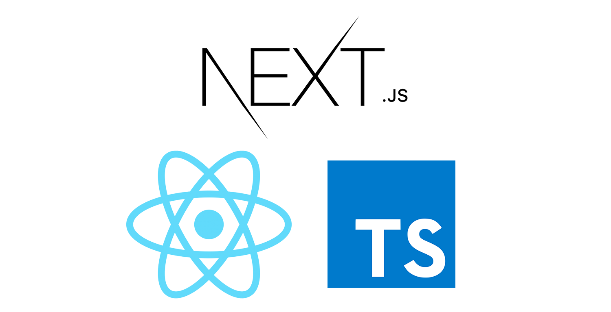

# nextjs-movie-browser

[](https://travis-ci.org/topheman/nextjs-movie-browser)
[](https://dashboard.cypress.io/#/projects/b2y7nt/runs)
[](https://topheman-movie-browser.herokuapp.com)

<p align="center"></p>

This project is a **NextJS** implementation of the [themoviedb.org](https://www.themoviedb.org) website. The main goal was to dive deep into the NextJS framework with the following constaints/features:

- **SSR (Server Side Rendering)**: use NextJS to Server Side render the page with the data retrieved from the API and have a transparent client side navigation
- **SEO friendly**: server side render meta tags relative to content based on API result
- **Social Media cards friendly**: server side render meta tags relative to twitter/facebook ... to customize thumbnails/description when page is shared (also works for slack, messenger, WhatsApp ...)
- **i18n**
  - Support multi-language
    - From the API content
    - From the UI
  - Support Right-to-Left (rtl) languages such as Hebrew, Persian ...
  - Switch language on the fly
- **High quality project**
  - code quality good practices (type checking, linting, unit/e2e testing, git hooks, cis ...)
  - automation / dev pipeline
  - documentation

Here is a list of some of the technologies I'm using:

- [NextJS](https://github.com/zeit/next.js/) / [ReactJS](https://github.com/facebook/react)
- [TypeScript](NOTES.md#typescript-support) / [Tslint](NOTES.md#tslint) / [Prettier](https://github.com/prettier/prettier)
- [Jest](NOTES.md#jest-support) / [Cypress.io](https://www.cypress.io/) / [react-testing-library](https://github.com/kentcdodds/react-testing-library) / [cypress-testing-library](https://github.com/kentcdodds/cypress-testing-library)

ℹ️ The [v1](#versions) was focused on SSR / i18n (backend and client behaviour), it has a basic design that lets you focus on those parts, the [v2](#versions) is currently focused on the design part.

🗒 [Read the notes I took along the way](NOTES.md).

## Prerequisites

- Nodejs v8
- yarn / npm

## Install

```shell
git clone https://github.com/topheman/nextjs-movie-browser.git
cd nextjs-movie-browser
yarn
```

You don't have `yarn` ? Run `npm install` - read more about why I'm using yarn.

## Setup

This project uses the [themoviedb.org](https://www.themoviedb.org/faq/api) api v3.

- Create an account or login on [www.themoviedb.org](https://www.themoviedb.org/)
- Create an API key in the [settings section](https://www.themoviedb.org/settings/api)
- Copy the API KEY (v3 auth) (for example: `YOUR_API_KEY`)

In your project, run the following (with your own api key):

```shell
./bin/initEnv.js --api-key YOUR_API_KEY
```

This will create two files: `.env.local` and `.env.test.local` (which won't be commited to git) with `NEXTJS_APP_CLIENT_TMDB_API_KEY=YOUR_API_KEY`.

That way, your api key will be taken in account directly in your development environment - read more about .env files.

## Development

```shell
npm run dev
```

This will start a development server on [http://localhost:3000](http://localhost:3000).

## Build

```shell
npm run build
```

This will build the a production version of the website in the `.next` folder.

## Production

First, you need to build your project running `npm run build`, then:

```shell
npm start
```

This will launch a production server on [http://localhost:3000](http://localhost:3000).

You can change the port passing a `PORT` env var like: `PORT=8080 npm start`.

## Test

The following command will run both unit and e2e (cypress) tests, in parallel:

```shell
npm test
```

You can choose to run them separately to have more readable logs (running in parallel unit and e2e tests runs faster but ends up with less readable logs).

### Unit

You'll find unit tests spread in the `src` folder inside `__tests__` folders in files named like `*.spec.ts`.

I'm using [Jest](https://facebook.github.io/jest/) as a test runner and [react-testing-library](https://github.com/kentcdodds/react-testing-library) as testing utilies.

- `npm run test:unit` : single run of the unit tests
- `npm run test:unit:watch` : run the unit tests in watch mode
- `npm run test:unit:coverage` : run the unit tests collecting coverage infos in `./coverage` folder.

### End to end

> End-to-end testing is a technique used to test whether the flow of an application right from start to finish is behaving as expected. The purpose of performing end-to-end testing is to identify system dependencies and to ensure that the data integrity is maintained between various system components and systems.
>
> The entire application is tested for critical functionalities such as communicating with the other systems, interfaces, database, network, and other applications.

I'm using [cypress.io](https://www.cypress.io/) for the e2e tests. You will find them in [cypress/integration](cypress/integration).

- `npm run test:cypress` : **single run the e2e tests**. It will:
  - build the project and launch a production server at [http://localhost:3000](http://localhost:3000) (that way, your tests reflect exactly what the end user would see in production)
  - run the tests in [cypress/integration](cypress/integration) folder
  - tear down once tests are passed (or failed)
- `npm run test:cypress:dev` : use this one when you're **coding your tests**. It will:
  - spin up a dev server on [http://localhost:3000](http://localhost:3000) (so, you don't have to `npm start`)
  - open the cypress client that will let you choose which tests you want to run
- `npm run test:cypress:debug-build` : use this if your e2e tests only fail on a production bundle, to **debug the tests with the production version** of your app. It will:
  - build the project and launch a production server at [http://localhost:3000](http://localhost:3000)
  - open the cypress client that will let you choose which tests you want to run

## Linter

I use [tslint](https://palantir.github.io/tslint/) to check the coding style, with the following presets:

- [tslint:recommended](https://palantir.github.io/tslint/usage/configuration/#configuration-presets)
- [tslint-config-airbnb](https://www.npmjs.com/package/tslint-config-airbnb) - a TypeScript version of the eslint-config-airbnb
- [tslint-config-prettier](https://github.com/prettier/tslint-config-prettier) - a config that disables all conflicting rules between Tslint and prettier (Tslint is for linting, prettier is for formatting)

More on [tslint configuration](NOTES.md#tslint).

The following command will run the linter on your code base. This task is ran at pre-commit to ensure code quality.

```shell
npm run lint
```

## Prettier

Prettier is a great tool to enforce a consistent style accross your code base (usefull when working in teams).

[Here is how to integrate it with your editor](https://prettier.io/docs/en/editors.html).

Once it's done, when you'll save a file, it will reformat it.

The following command will let you format your code base. This task is ran at pre-commit.

```shell
npm run pretty
```

## Environment files

Just like in create-react-app, you can use `.env` file to store your env vars that will be injected to your app.

[Check my implementation](scripts/config/env.js)

What `.env` file can be used ?

- `.env`: Default.
- `.env.local`: Local overrides. **This file is loaded for all environments except test.**
- `.env.development`, `.env.test`, `.env.production`: Environment-specific settings.
- `.env.development.local`, `.env.test.local`, `.env.production.local`: Local overrides of environment-specific settings.

Files on the left have more priority than files on the right:

- `npm run dev`: `.env.development.local`, `.env.development`, `.env.local`, `.env`
- `npm run build` / `npm start`: `.env.production.local`, `.env.production`, `.env.local`, `.env`
- `npm test`: `.env.test.local`, `.env.test`, `.env` (note `.env.local` is missing)

Env vars are filtered before being injected:

- `NEXTJS_APP_CLIENT_*`: will be accessible both client and server side (via `process.env.NEXTJS_APP_CLIENT_*`)
- `NEXTJS_APP_SERVER_*`: will be accessible only server side (via `process.env.NEXTJS_APP_SERVER_*`) (you might wan't store env vars and not leek them to the frontend)

## Deploy

See [Heroku](NOTES.md#heroku) section in notes

## Continuous Integration

Each `git push` triggers a test suite on [travis](https://travis-ci.org/topheman/nextjs-movie-browser). The following will be ran:

- linting
- type checking
- unit tests
- end to end test with cypress

The end to end test sessions are recorded, you can check them [here](https://dashboard.cypress.io/#/projects/b2y7nt/runs).

## Commit guidelines

To have uniform commit messages, I follow the [AngularJS git commit guidelines](https://github.com/angular/angular.js/blob/master/CONTRIBUTING.md#-git-commit-guidelines), please take a look at it.

It also makes it easier to generate changelogs.

To generate changelog:

```shell
npm run generate-changelog -- v1.1.0 v1.2.0
```

Ready to be pasted to the github releases part.

## FAQ

### Versions

#### v2 (current)

This is a work in progress of the design part.

#### v1

The v1 has a strong setup for the SSR / SEO / i18n part also for code quality (type checking, linting, unit/e2e testing, git hooks ...).

It has a very basic design. I mainly focused on the NextJS part in order to do only design on the v2.

The code is available on this [branch](https://github.com/topheman/nextjs-movie-browser/tree/v1.x).

### Precommit hook

Thanks to [husky](https://www.npmjs.com/package/husky), you can simply add git hooks.

That way, once you install the project, you'll have a precommit hook installed. The following tasks are executed at each commit:

- `npm run lint`: lints the project source code with [tslint](NOTES.md#tslint) (both `.js(x)` and `.ts(x)` files)
- `npm run ts:check`: type check `.ts` and `.tsx` files
- `npm test`: runs in parallel unit and e2e tests

## Resources

This project is based on previous work:

- ⚛️ [topheman/npm-registry-browser](https://github.com/topheman/npm-registry-browser)
- ️⚛️ [topheman/react-fiber-experiments](https://github.com/topheman/react-fiber-experiments)
- 📝 [Cypress.io advanced setup](http://dev.topheman.com/cypress-io-advanced-setup/)
- 📝 [Continuous deployment with Travis CI](http://dev.topheman.com/continuous-deployment-with-travis-ci/)
- 📝 [Add metadatas to your build files](http://dev.topheman.com/add-metadatas-to-your-build-files/)

More resources on the [NOTES.md](NOTES.md) file.
